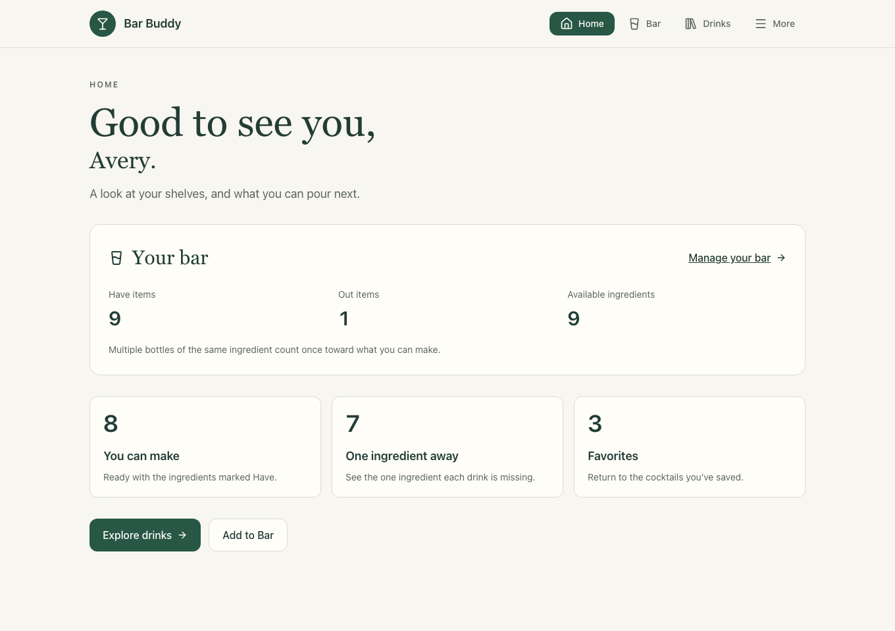
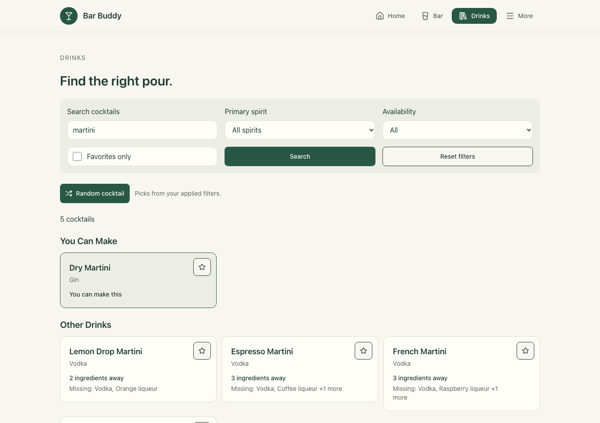
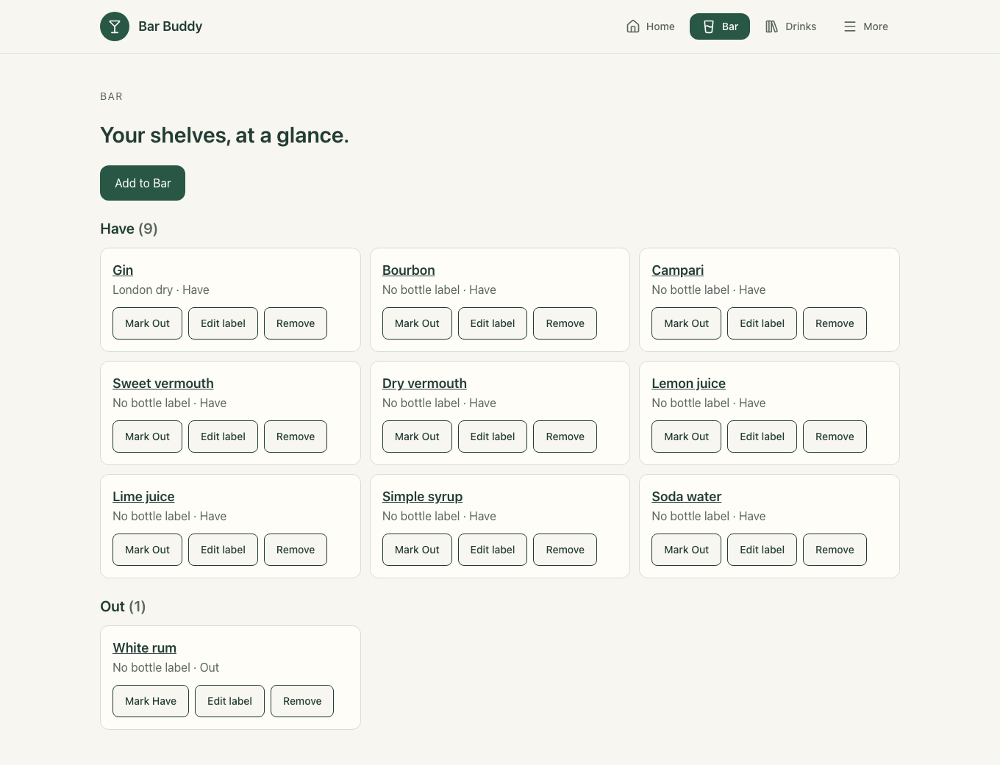

# Bar Buddy

**Know your bar. Find your next drink.**

Bar Buddy helps you keep track of your home-bar ingredients and discover cocktails you can make with what you already have. See exactly what is missing, save your favorites, or let Bar Buddy pick a drink for you.

- **Your bar:** track ingredients and individual bottles, with simple Have and Out states.
- **Your next pour:** browse 102 cocktails, follow their recipes, and find drinks that are just one ingredient away.
- **Your favorites:** save drinks and narrow your next random pick by your current filters.
- **Your account:** keep your bar private, add your name, and manage your account.

Designed for phones, tablets, and desktops.

**Public app:** [Open Bar Buddy](https://barbuddy.projects.williamsestate.net).

Changes ship through reviewed GitHub pull requests. Merging a passing PR into `main` automatically deploys the website and API; see the [development workflow](docs/07-development-workflow.md).

## A look inside

Screenshots use a sample account and illustrative inventory.







## Run locally

You’ll need **Java 25**, **Node.js 24 / npm 11**, **Docker Compose v2**, and a **Supabase Auth project** for sign-in.

1. Clone the repository and start the local database:

   ```sh
   git clone https://github.com/mrnoahjwilliams/bar-buddy.git
   cd bar-buddy
   docker compose up -d --wait
   ```

2. Create local configuration and install the frontend dependencies:

   ```sh
   install -m 600 backend/.env.example backend/.env
   cp frontend/.env.example frontend/.env
   npm --prefix frontend ci
   ```

   Configure Supabase using the [authentication setup](docs/08-local-development.md#authentication). The example files alone do not enable sign-in. Keep the database local unless you deliberately configure a hosted database.

3. Build and import the cocktail catalog into your configured database:

   ```sh
   cd backend
   ./mvnw --batch-mode --no-transfer-progress verify
   java -Dloader.main=com.barbuddy.catalog.CatalogImportApplication \
     -cp target/bar-buddy-0.0.1-SNAPSHOT.jar \
     org.springframework.boot.loader.launch.PropertiesLauncher catalog/cocktails.json
   ./mvnw spring-boot:run
   ```

4. In another terminal, start the frontend from the repository root:

   ```sh
   npm --prefix frontend run dev
   ```

Open [Bar Buddy locally](http://127.0.0.1:5173). See [Local development](docs/08-local-development.md) for configuration, account-deletion setup, database management, and verification commands.

## Documentation

Bar Buddy uses React and TypeScript, a Spring Boot API, PostgreSQL, and Supabase Auth.

- [Product definition](docs/01-definition.md) and [requirements](docs/02-requirements.md)
- [Technical design](docs/03-design.md) and [development guidelines](docs/04-development-guidelines.md)
- [Implemented behavior](docs/05-documentation.md) and [roadmap](docs/06-plan.md)
- [Development workflow](docs/07-development-workflow.md) and [local setup](docs/08-local-development.md)
- [Cocktail catalog](backend/catalog/README.md)
