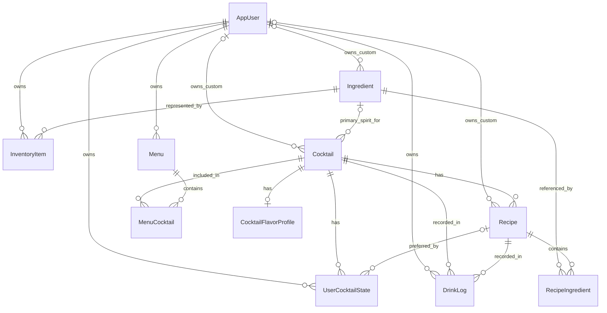

# Design

Accepted technical design through Release 7. This describes the target, not implemented state. [Requirements](02-requirements.md) owns behavior; [Plan](06-plan.md) contains unresolved decision gates; [Documentation](05-documentation.md) records implementation. Refine decisions in their owning document before depending on them.

## Architecture and stack

React SPA → REST/JSON with Supabase JWT → Spring Boot API → JPA/Hibernate → PostgreSQL.

Use a feature-oriented modular monolith. Automate plumbing while keeping business decisions visible in application services. Supabase provides Auth and PostgreSQL infrastructure, not application authorization, domain logic or Data API access. Keep application components portable across commodity hosting providers.

Disable the unused Supabase Data API and remove application-object access for `anon`/`authenticated`, including inherited/public and default grants that could expose new tables or functions. Keep database credentials on trusted servers; retain Supabase Auth for authentication. Spring accepts only asymmetric ES256/RS256 access tokens verified through the project's public JWKS, with issuer, `authenticated` audience, lifetime and nonblank `sub` validation; it never receives the JWT signing secret. Verify the configured boundary using [Supabase's access controls](https://supabase.com/docs/guides/api/securing-your-api), rather than relying on provider defaults.

| Area | Accepted technology |
|---|---|
| Frontend | React 19, TypeScript, Vite, React Router, TanStack Query, Tailwind CSS, shadcn/ui, Orval; Vitest and React Testing Library |
| Backend | Java 25 LTS, Spring Boot 4.1, Spring MVC, Spring Security, Spring Data JPA/Hibernate, Jakarta Validation, Flyway, springdoc-openapi; JUnit, Spring Boot Test and Testcontainers |
| Identity/data | Supabase Auth JWT issuance; Spring token validation and application authorization; PostgreSQL initially hosted by Supabase |
| Delivery | Responsive PWA first; optional later Capacitor packaging. GitHub/GitHub Actions and execution policy are specified in Workflow. Vercel Hobby serves the SPA, Render Free runs the container, Supabase Free supplies Auth/PostgreSQL, and Resend Free supplies Auth SMTP. See the hosting decision below. |

Foundation verifies compatible patch/library versions, chooses the remaining toolchain details, and commits wrappers/lockfiles. Do not substitute a different accepted stack without a decision.

The initial local toolchain uses Maven with separate Surefire (`*Test`) and Failsafe (`*IT`) runners, Spotless with Google Java Format, and selected Checkstyle rules. Frontend tooling uses Node 24 LTS/npm, Prettier, ESLint, and jsdom for Vitest. TypeScript 6 is selected because the verified typescript-eslint version supports versions below 6.1; the latest TypeScript major is not yet compatible. Exact library versions live in [the Maven build](../backend/pom.xml) and [the npm manifest/lockfile](../frontend/package.json). PostgreSQL 17 is pinned to the same patch image in local Compose and Testcontainers. [Local development](08-local-development.md) owns prerequisites and commands.

Request flow: Spring Security → Jackson → validated request DTO → controller → service → repository/JPA → PostgreSQL. Response flow: entity/service result → response DTO → JSON → generated TanStack Query hook → React. Services own transaction boundaries; neither DTO mapping nor repositories decide business policy. Keep simple mapping explicit; introduce a mapping library only when repeated structural mapping makes it a net improvement.

## Repository structure

The product name is **Bar Buddy**, repository slug `bar-buddy`, and Java base package `com.barbuddy`. Create application roots during foundation, only adding features when needed. The intended structure is:

```text
AGENTS.md, README.md, .gitignore
docs/01-definition.md … 08-local-development.md
.github/pull_request_template.md
.github/workflows/                         # Foundation CI
backend/
  catalog/                               # Dataset, validator, fixtures and provenance
  contracts/openapi.json                 # Generated backend contract
  pom.xml, mvnw, .mvn/, Dockerfile         # Container file when needed
  src/main/java/com/barbuddy/
    auth/, users/, ingredients/, cocktails/, inventory/
    shopping/, history/, menus/, recommendations/
    shared/{config,errors,measurement,security}/
  src/main/resources/application.yml
  src/main/resources/db/migration/
  src/test/java/
frontend/
  package.json, lockfile, vite.config.ts, orval.config.ts, tsconfig.json
  public/
  src/app/{router,providers,layout}/
  src/features/{home,bar,ingredients,drinks,shopping,history,menus,profile,recommendations}/
  src/api/generated/
  src/components/ui/
  src/lib/, src/assets/
```

Features stay relatively flat; add `dto/` where useful. Braces denote sibling directories; create them only as needed. Shopping is a module even though its UI is a Drinks mode.

The tracked API contract is `backend/contracts/openapi.json`; Orval owns `frontend/src/api/generated/`, including its separate models and TanStack Query client. Both directories contain generated artifacts only. Generation exports application paths under `/api/v1` in a full Spring test context with disposable PostgreSQL, with stable metadata, relative server URLs and deterministic key ordering. Runtime documentation remains disabled. Orval uses Fetch with body-only success results and the narrow `frontend/src/api/http.ts` adapter for HTTP errors, token attachment, one shared refresh attempt for concurrent unauthorized requests, and response decoding; it preserves request options and cancellation. [Local development](08-local-development.md#catalog-and-api-generation) owns generation/drift commands. See [springdoc properties](https://springdoc.org/properties.html) and [Orval Fetch integration](https://orval.dev/docs/guides/fetch-client/) for the underlying configuration.

## Domain model

The target is locked to these eleven persistent entities; do not introduce separate custom-content or derived-result entities.

| Entity | Introduced | Responsibility |
|---|---|---|
| AppUser | 1 | Local identity linked uniquely to validated Supabase `sub` |
| Ingredient | 1 | Canonical ingredient; category: spirit, liqueur, fortified wine, bitters, syrup, juice, mixer, fruit, herb, garnish or other |
| Cocktail | 1 | Conceptual drink, optionally referencing a primary-spirit Ingredient |
| Recipe | 1 | One preparation of a Cocktail; supports multiple recipes from the initial catalog model |
| RecipeIngredient | 1 | Recipe/Ingredient link with quantity, unit, requirement type and display order |
| InventoryItem | 1 | Owner, Ingredient, optional bottle label, Have/Out; Wishlist in 3 and optional quantity tracking in 5 |
| UserCocktailState | 1 | Owner/Cocktail preference: favorite initially; rating, notes, hidden, never-recommend and preferred Recipe in 6 |
| DrinkLog | 4 | Owner, Cocktail, selected Recipe, servings and madeAt; retry handling must be decided before its schema/API |
| Menu | 6 | User-owned named collection |
| MenuCocktail | 6 | Menu membership and cocktail order |
| CocktailFlavorProfile | 7 | Cocktail flavor/intensity metadata |

Releases 2, 3 and 5 introduce no persistent entities. Release 2 uses the catalog's optional, non-exclusive cocktail styles and stores photo references, aliases, later tags, alcohol-free classification and preparation/visual metadata in existing catalog entities/value types. Recently viewed and appearance settings use agreed client storage or existing user/state fields; no new tracking entity. Recipe conversion/scaling/batch outputs are non-persistent calculations. Frequency and rating sorts derive from the current user's existing logs/preferences. Release 6 adds nullable `ownerUserId` to Ingredient, Cocktail and Recipe: null means shared system content; an AppUser reference means private custom content. Keep new fields within the existing entities, including any retry data chosen for DrinkLog. The retry policy itself remains undecided.



Non-persistent results/value objects include AvailabilityResult, MissingIngredient, UnlockImpact, ShoppingPlan, DrinkStatistics, recommendations, Measurement and enums. Requirements owns their calculation rules. Initially use the curated recipe chosen in catalog preparation; quantity-aware behavior is decided in Release 5 and multiple-recipe/default behavior in Release 6.

### MVP usability mechanics

Catalog schema version 2 adds a required aliases array to each ingredient; version 1 remains importable with empty aliases. Store aliases as a PostgreSQL text array on Ingredient (no additional entity). Normalize search using lowercase Unicode NFD plus removal of combining accents in both PostgreSQL and Java. Aliases are search-only, validated against normalized names/aliases to prevent ambiguous exact labels. No provider extension is required. Ingredient summaries may expose a matchedAlias explanation.

Detail overlays use repeated `detail=ingredient:<uuid>` / `detail=cocktail:<uuid>` query parameters on the current catalog route. The catalog stays mounted beneath one accessible modal dialog; nested details retain their own scroll and drafts. Browser history tracks each opening, with safe close fallback for a direct link. Existing path-based detail URLs remain supported.

## Offline catalog format

Release 0 catalog preparation uses the versioned Bar Buddy JSON dataset under [`backend/catalog/`](../backend/catalog/README.md). It contains stable namespaced ingredient, cocktail and default-recipe identifiers, canonical ingredient references/categories, recipe-specific display wording, optional non-exclusive cocktail styles, ordered requirement lines, reviewed US/metric measurement pairs, instructions, glassware and garnish. Recipe wording may be more specific than its canonical inventory match so availability stays practical without losing recipe detail. The application never scrapes a source website at runtime.

Each initial cocktail has one default recipe. Every ingredient line has US and metric measurements with quantity, optional maximum, unit and optional scant/heavy modifier; US is the catalog default. Keeping both reviewed representations preserves exact metric recipes and practical US bar measures without requiring a reversible conversion. Acquisition tools, the dated source snapshot and detailed curation records are isolated in the unmaintained provenance archive. The reviewed, validated dataset is the import source for 1.2.1.

The schema-version-aware catalog validator is dependency-free Node tooling under `backend/catalog/` and runs in the existing frontend CI job. A database import validates the entire file before writing, then matches Ingredient, Cocktail and Recipe only by immutable catalog ID and preserves the matched database identities. RecipeIngredient lines synchronize by stable recipe ID plus validated display position because lines have no external identity. Corrected display data updates in place; matching never guesses from names or similar text, and a missing stable entity is not an implicit deletion. Identity replacement or retirement requires an explicit reference-preserving migration/mapping. The operator-only Java import entry point bundles and invokes that same validator with Node against an immutable file snapshot before starting Spring or opening the database. It starts a non-web context, applies migrations, and invokes a transactional service; normal server startup does not import anything. The bulk import repository uses Spring JDBC with PostgreSQL JSON expansion and upserts, keeping query count independent of catalog size while normal entity access retains JPA mappings. A transaction-scoped advisory lock serializes imports. Existing cocktail slugs and recipe-to-cocktail membership are compatibility values; changing them requires a reviewed migration. Styles are validated but remain source metadata until Release 2. [Local development](08-local-development.md#catalog-and-api-generation) owns the operator command and runtime requirements.

## API action surface

All paths below are relative to `/api/v1`. Preserve the user actions; path wording may be refined with contracts and generated clients updated together. Lists support the search/filter/sort/availability parameters scheduled for their release; pagination is introduced when warranted.

| Release | Operations |
|---|---|
| 1 | `GET`, `PUT`, `DELETE /me`; `GET /home`; `GET /ingredients`, `/ingredients/{id}`; `GET`, `POST /inventory`; `PATCH`, `DELETE /inventory/{id}`; `GET /cocktails`, `/cocktails/{id}`, `/cocktails/random`; `PUT /cocktails/{id}/preference` |
| 2 | Enrich discovery/list/detail operations for optional style filtering, metadata, aliases, new sorts and recently viewed behavior; settle any required state operation under the existing user/preference surface. Print/mixing/share behavior reuses the selected catalog recipe; sharing creates no public custom-content API. |
| 3 | `GET /ingredients/{id}/unlock-impact`; `GET /shopping/recommendations`; `POST /shopping/plan` |
| 4 | `GET`, `POST /drink-logs`; `GET /drink-logs/statistics`. POST is Made This Drink, not generic row insertion; include the agreed safe-retry contract. |
| 5 | Extend inventory/cocktail responses and Made This Drink with quantities/atomic deductions; reuse the same measurement rules for display conversion, scaling and batch previews, with any calculation contract documented before integration. |
| 6 | `POST /ingredients` for private custom ingredients; `POST /cocktails`; `POST /cocktails/{id}/recipes`; `PATCH`, `DELETE /recipes/{id}`; extend preference updates; `GET`, `POST /menus`; `GET`, `PATCH`, `DELETE /menus/{id}`; `POST /menus/{id}/cocktails`; `DELETE /menus/{id}/cocktails/{cocktailId}`. Menu updates must cover ordering; detailed membership semantics remain a decision gate. |
| 7 | `GET /recommendations/drinks`, `/recommendations/ingredients`, `/cocktails/{id}/similar`; add cocktail-of-the-day through the agreed recommendation contract. |

Backend DTOs/controllers generate springdoc OpenAPI; Orval generates TypeScript types, client and query hooks consumed by React. Custom transport integration may handle authentication without duplicating generated operations. Keep authentication errors and domain validation consistent.

Home uses a read-only `/home` summary DTO, with owner-scoped inventory counts and the same catalog availability/favorite calculation as Drinks. Return counts rather than transferring the catalog to the browser. Random selection reuses Drinks eligibility and returns one uniformly selected summary; a 404 problem response means no eligible candidates. Neither operation persists derived state. The browser invokes the generated random request only on demand, cancels obsolete requests, and opens the existing detail overlay.

## UI and verification boundaries

Requirements owns navigation and screen behavior. Reuse ingredient detail across owned/unowned inventory. Photos/visuals, dark mode, print/share and mixing view arrive in Release 2; Made This Drink in Release 4; conversion/scaling/batch tools in Release 5; recipe selection in Release 6; flavor/strength and daily suggestions in Release 7. Asset coverage/fallback and sharing details remain explicit Release 2 decisions.

Use unit tests for business-heavy services, Spring Boot/Testcontainers for security, persistence, migrations and transactions, and frontend tests for meaningful behavior/state transitions. Guidelines specifies test conventions; Plan lists milestone-specific cases. No arbitrary coverage target or numeric performance target has been selected.

## MVP profile and deletion lifecycle

AppUser owns the optional display name plus deletion-request/completion timestamps. Profile updates derive ownership only from the validated JWT. Resolving a mutable user obtains a row lock and rejects deletion tombstones so concurrent create/profile/favorite requests cannot resurrect deleted data.

Account deletion atomically removes owned inventory and preferences, clears the name, and marks the existing AppUser row. A security-chain filter checks this marker for every authenticated request; repeated DELETE requests return 202, and other requests from a deleted subject return 401. A minute-based worker hard-deletes the provider login with a server-only Supabase admin key, accepts already-deleted identities, and records completion only after success. This avoids coupling a database commit to an irreversible network call. [Supabase documents](https://supabase.com/docs/guides/auth/managing-user-data) that deleting a login does not invalidate already-issued JWTs; the local marker enforces immediate denial. The existing identity row is the durable retry record and token-replay tombstone, not a new product entity. [Local development](08-local-development.md#account-deletion) owns configuration, retention and recovery operations.

The browser transport captures the account session generation before a request. It checks that generation before dispatch/retry and after asynchronous responses, and discards obsolete work. A refresh result cannot replace a newer account session. Profile edits reset on account change and do not repopulate the cache after unmount.

## MVP hosting decision

Selected September 9, 2026 under the user's strict $0 requirement: Vercel Hobby +
Render Free, keeping Supabase Free. Fly.io is excluded because it has no ongoing
free tier. This fits the existing Java application without a stack rewrite.
Provider terms may change; pause or migrate rather than authorize charges.

The canonical browser origin is `https://barbuddy.projects.williamsestate.net`.
Cloudflare remains authoritative DNS; its app CNAME is DNS-only so Vercel can
terminate TLS for this nested hostname without a paid Cloudflare certificate.
Vercel proxies `/api/**` to the selected Render HTTPS origin, before SPA fallback.
Browser requests remain same-origin; no permissive CORS policy is needed. API
responses are never CDN-cached. Hosting output is generated from an explicit
`BACKEND_ORIGIN`, never a guessed service name. Production follows reviewed merges to protected `main`: Vercel deploys only `main`,
and Render deploys after its CI checks pass. The user authorized this continuous
delivery policy on September 10, 2026. Provider builds finish independently, so
API/schema changes must support both the previous and new frontend during rollout.
[Workflow](07-development-workflow.md#continuous-delivery) owns the merge/deploy contract.

Render uses one free web service with ephemeral storage, a bounded Java heap and
small JDBC pool. Supabase's IPv4-compatible session pooler with TLS supports both
Flyway and JPA. Flyway runs at startup; catalog import remains an explicit local
operator command against the selected hosted database. No temporary Render database,
paid disk, cron job, or artificial keep-alive is provisioned. Idle sleep delays both
first requests and pending account-deletion retries; durable markers survive sleep.

Resend Free sends Supabase Auth messages from
`Bar Buddy <noreply@barbuddy.projects.williamsestate.net>`. Supabase holds the SMTP
credential; Render never sends SMTP. Editable templates live in `deploy/auth/`.
Provider confirmation links retain Supabase's verification endpoint and redirect to
the app; a custom Supabase Auth domain is not purchased. The PWA uses repository-owned
cocktail-glass artwork and a network-only service worker, with no offline private-data
cache. [Local development](08-local-development.md#production-hosting) owns setup,
limits, DNS, email delivery, backup and recovery procedures.
