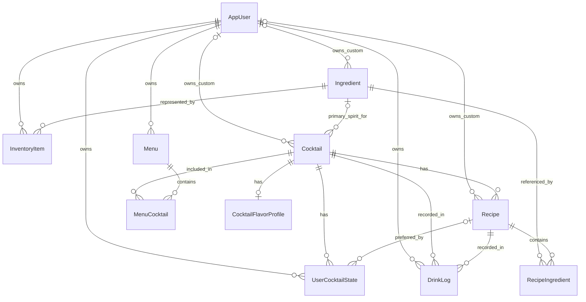

# Design

Accepted technical design through Release 7. This describes the target, not implemented state. [Requirements](02-requirements.md) owns behavior; [Plan](06-plan.md) contains unresolved decision gates; [Documentation](05-documentation.md) records implementation. Refine decisions in their owning document before depending on them.

## Architecture and stack

React SPA → REST/JSON with Supabase JWT → Spring Boot API → JPA/Hibernate → PostgreSQL.

Use a feature-oriented modular monolith. Automate plumbing while keeping business decisions visible in application services. Supabase provides Auth and PostgreSQL infrastructure, not application authorization, domain logic or Data API access. Keep application components portable across commodity hosting providers.

Disable the unused Supabase Data API and remove application-object access for `anon`/`authenticated`, including inherited/public and default grants that could expose new tables or functions. Keep database credentials on trusted servers; retain Supabase Auth for authentication. Verify the configured boundary using [Supabase's access controls](https://supabase.com/docs/guides/api/securing-your-api), rather than relying on provider defaults.

| Area | Accepted technology |
|---|---|
| Frontend | React 19, TypeScript, Vite, React Router, TanStack Query, Tailwind CSS, shadcn/ui, Orval; Vitest and React Testing Library |
| Backend | Java 25 LTS, Spring Boot 4.1, Spring MVC, Spring Security, Spring Data JPA/Hibernate, Jakarta Validation, MapStruct, Flyway, springdoc-openapi; JUnit, Mockito, Spring Boot Test and Testcontainers |
| Identity/data | Supabase Auth JWT issuance; Spring token validation and application authorization; PostgreSQL initially hosted by Supabase |
| Delivery | Responsive PWA first; optional later Capacitor packaging. GitHub/GitHub Actions and execution policy are specified in Workflow. Hosting/deployment provider decisions remain in the publication milestone. |

Foundation verifies compatible patch/library versions, chooses the remaining toolchain details, and commits wrappers/lockfiles. Do not substitute a different accepted stack without a decision.

Request flow: Spring Security → Jackson → validated request DTO → controller → service → repository/JPA → PostgreSQL. Response flow: entity/service result → MapStruct response DTO → JSON → generated TanStack Query hook → React. Services own transaction boundaries; neither mappers nor repositories decide business policy.

## Repository structure

The product name is **Bar Buddy**, repository slug `bar-buddy`, and Java base package `com.barbuddy`. Create application roots during foundation, only adding features when needed. The intended structure is:

```text
AGENTS.md, README.md, .gitignore
docs/01-definition.md … 07-development-workflow.md
.github/pull_request_template.md
.github/workflows/                         # Foundation CI
backend/
  pom.xml, mvnw, .mvn/, Dockerfile         # Container file when needed
  src/main/java/com/barbuddy/
    auth/, users/, ingredients/, cocktails/, inventory/
    shopping/, history/, menus/, recommendations/
    shared/{config,errors,measurement,security}/
  src/main/resources/application.yml
  src/main/resources/db/migration/
  src/test/java/
frontend/
  package.json, lockfile, vite.config.ts, orval.config.ts, tsconfig.json
  public/
  src/app/{router,providers,layout}/
  src/features/{home,bar,ingredients,drinks,shopping,history,menus,profile,recommendations}/
  src/api/generated/
  src/components/ui/
  src/lib/, src/assets/
```

Features stay relatively flat; add `dto/` where useful. Braces denote sibling directories; create them only as needed. Shopping is a module even though its UI is a Drinks mode. The public API-contract artifact location is established during foundation; generated contracts/client remain tracked.

## Domain model

The target is locked to these eleven persistent entities; do not introduce separate custom-content or derived-result entities.

| Entity | Introduced | Responsibility |
|---|---|---|
| AppUser | 1 | Local identity linked uniquely to validated Supabase `sub` |
| Ingredient | 1 | Canonical ingredient; category: spirit, liqueur, fortified wine, bitters, syrup, juice, mixer, fruit, herb, garnish or other |
| Cocktail | 1 | Conceptual drink, optionally referencing a primary-spirit Ingredient |
| Recipe | 1 | One preparation of a Cocktail; supports multiple recipes from the initial catalog model |
| RecipeIngredient | 1 | Recipe/Ingredient link with quantity, unit, requirement type and display order |
| InventoryItem | 1 | Owner, Ingredient, optional bottle label, Have/Out; Wishlist in 3 and optional quantity tracking in 5 |
| UserCocktailState | 1 | Owner/Cocktail preference: favorite initially; rating, notes, hidden, never-recommend and preferred Recipe in 6 |
| DrinkLog | 4 | Owner, Cocktail, selected Recipe, servings and madeAt; retry handling must be decided before its schema/API |
| Menu | 6 | User-owned named collection |
| MenuCocktail | 6 | Menu membership and cocktail order |
| CocktailFlavorProfile | 7 | Cocktail flavor/intensity metadata |

Releases 2, 3 and 5 introduce no persistent entities. Release 2 stores photo references, aliases, tags, alcohol-free classification and preparation/visual metadata in existing catalog entities/value types. Recently viewed and appearance settings use agreed client storage or existing user/state fields; no new tracking entity. Recipe conversion/scaling/batch outputs are non-persistent calculations. Frequency and rating sorts derive from the current user's existing logs/preferences. Release 6 adds nullable `ownerUserId` to Ingredient, Cocktail and Recipe: null means shared system content; an AppUser reference means private custom content. Keep new fields within the existing entities, including any retry data chosen for DrinkLog. The retry policy itself remains undecided.



Non-persistent results/value objects include AvailabilityResult, MissingIngredient, UnlockImpact, ShoppingPlan, DrinkStatistics, recommendations, Measurement and enums. Requirements owns their calculation rules. Initially use the curated recipe chosen in catalog preparation; quantity-aware behavior is decided in Release 5 and multiple-recipe/default behavior in Release 6.

## API action surface

All paths below are relative to `/api/v1`. Preserve the user actions; path wording may be refined with contracts and generated clients updated together. Lists support the search/filter/sort/availability parameters scheduled for their release; pagination is introduced when warranted.

| Release | Operations |
|---|---|
| 1 | `GET /me`; `GET /ingredients`, `/ingredients/{id}`; `GET`, `POST /inventory`; `PATCH`, `DELETE /inventory/{id}`; `GET /cocktails`, `/cocktails/{id}`, `/cocktails/random`; `PUT /cocktails/{id}/preference` |
| 2 | Enrich discovery/list/detail operations for metadata, aliases, new sorts and recently viewed behavior; settle any required state operation under the existing user/preference surface. Print/mixing/share behavior reuses the selected catalog recipe; sharing creates no public custom-content API. |
| 3 | `GET /ingredients/{id}/unlock-impact`; `GET /shopping/recommendations`; `POST /shopping/plan` |
| 4 | `GET`, `POST /drink-logs`; `GET /drink-logs/statistics`. POST is Made This Drink, not generic row insertion; include the agreed safe-retry contract. |
| 5 | Extend inventory/cocktail responses and Made This Drink with quantities/atomic deductions; reuse the same measurement rules for display conversion, scaling and batch previews, with any calculation contract documented before integration. |
| 6 | `POST /ingredients` for private custom ingredients; `POST /cocktails`; `POST /cocktails/{id}/recipes`; `PATCH`, `DELETE /recipes/{id}`; extend preference updates; `GET`, `POST /menus`; `GET`, `PATCH`, `DELETE /menus/{id}`; `POST /menus/{id}/cocktails`; `DELETE /menus/{id}/cocktails/{cocktailId}`. Menu updates must cover ordering; detailed membership semantics remain a decision gate. |
| 7 | `GET /recommendations/drinks`, `/recommendations/ingredients`, `/cocktails/{id}/similar`; add cocktail-of-the-day through the agreed recommendation contract. |

Backend DTOs/controllers generate springdoc OpenAPI; Orval generates TypeScript types, client and query hooks consumed by React. Custom transport integration may handle authentication without duplicating generated operations. Keep authentication errors and domain validation consistent.

## UI and verification boundaries

Requirements owns navigation and screen behavior. Reuse ingredient detail across owned/unowned inventory. Photos/visuals, dark mode, print/share and mixing view arrive in Release 2; Made This Drink in Release 4; conversion/scaling/batch tools in Release 5; recipe selection in Release 6; flavor/strength and daily suggestions in Release 7. Asset coverage/fallback and sharing details remain explicit Release 2 decisions.

Use unit tests for business-heavy services, Spring Boot/Testcontainers for security, persistence, migrations and transactions, and frontend tests for meaningful behavior/state transitions. Guidelines specifies test conventions; Plan lists milestone-specific cases. No arbitrary coverage target or numeric performance target has been selected.
